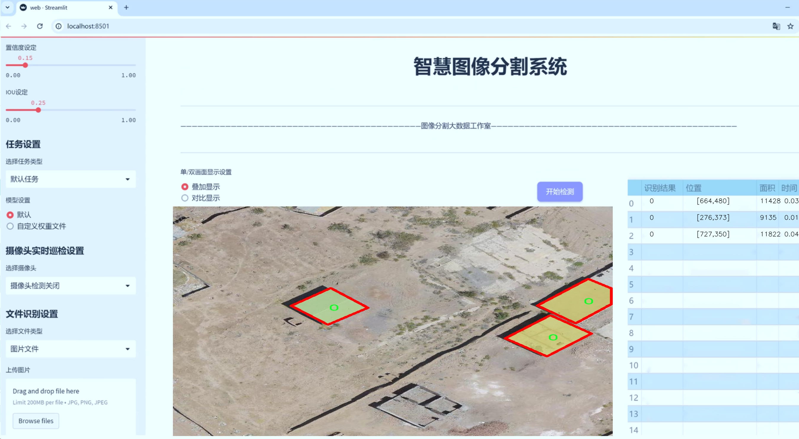
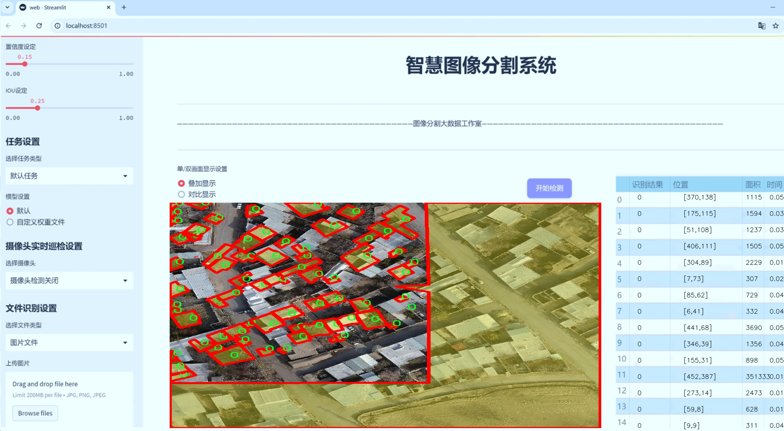
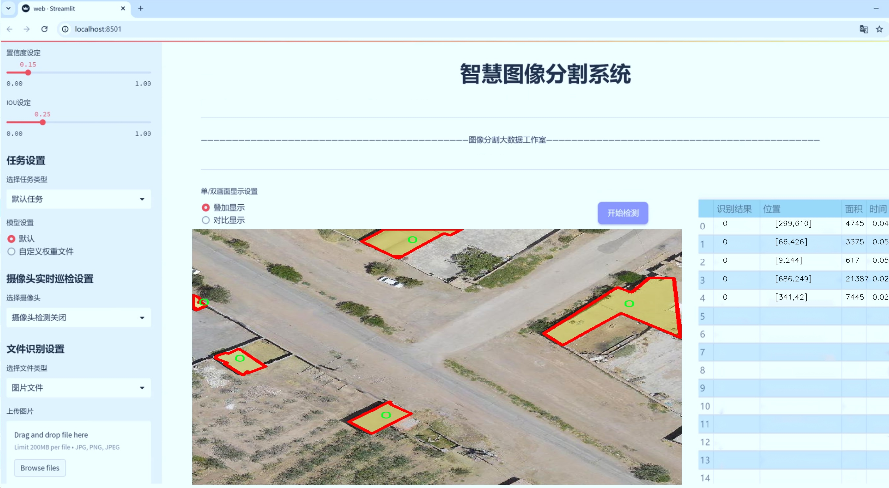
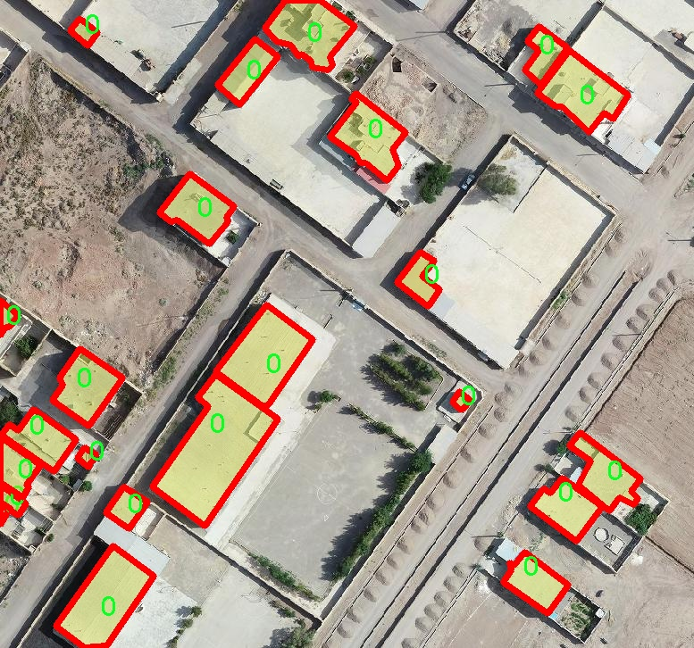
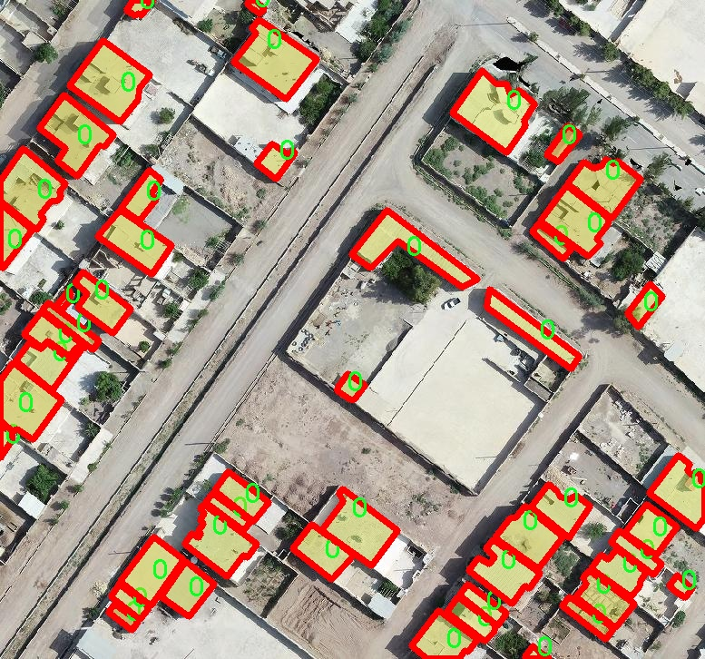
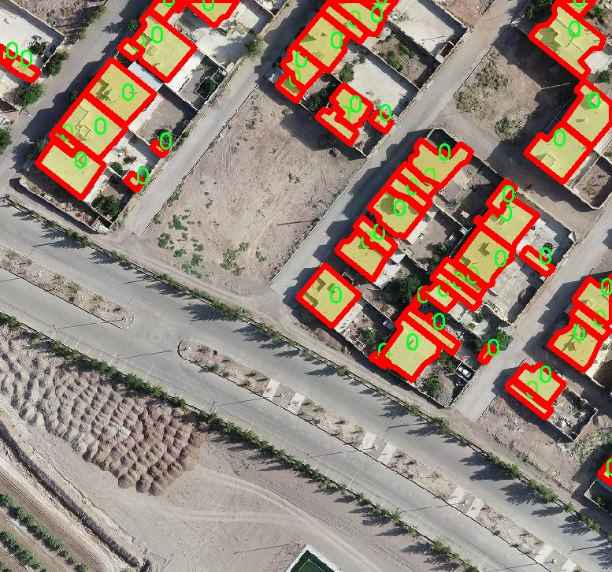
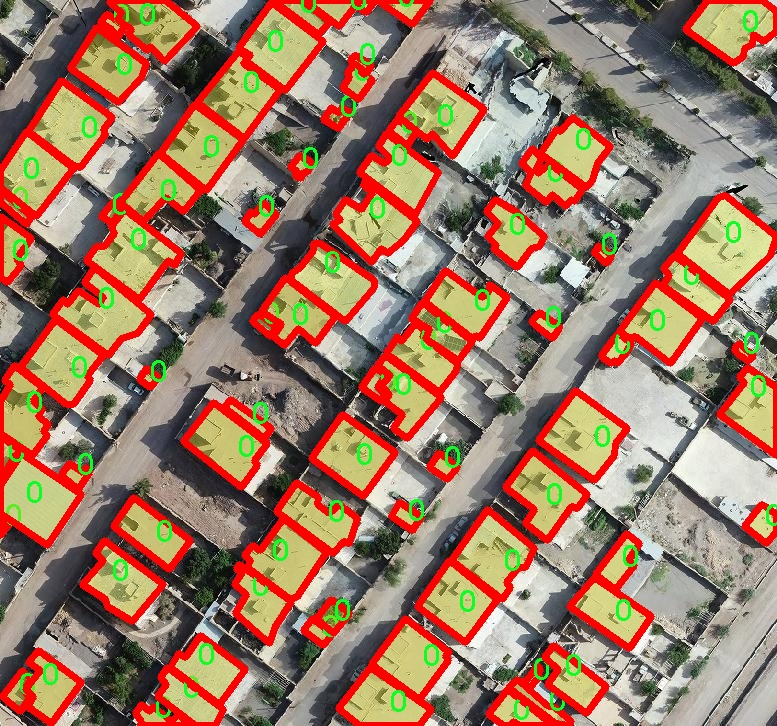
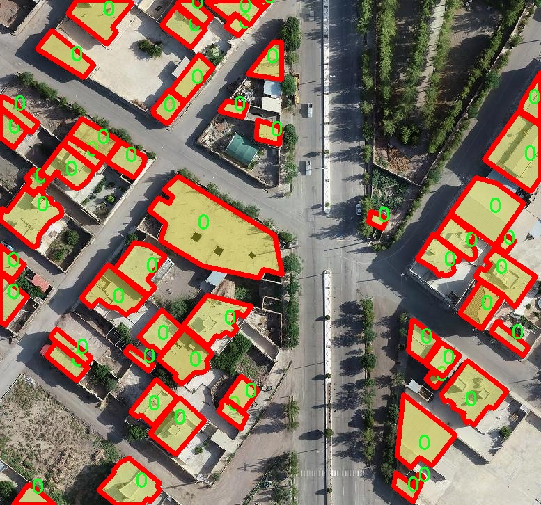

# 航拍图像建筑物轮廓分割系统源码＆数据集分享
 [yolov8-seg-C2f-DCNV2＆yolov8-seg-rtdetr等50+全套改进创新点发刊_一键训练教程_Web前端展示]

### 1.研究背景与意义

项目参考[ILSVRC ImageNet Large Scale Visual Recognition Challenge](https://gitee.com/YOLOv8_YOLOv11_Segmentation_Studio/projects)

项目来源[AAAI Global Al lnnovation Contest](https://kdocs.cn/l/cszuIiCKVNis)

研究背景与意义

随着城市化进程的加速，建筑物的数量和种类日益增加，如何高效、准确地提取建筑物轮廓信息成为城市规划、土地管理和环境监测等领域的重要任务。传统的建筑物轮廓提取方法多依赖于人工标注和简单的图像处理技术，这不仅耗时耗力，而且在处理复杂场景时容易出现误差。近年来，深度学习技术的迅猛发展为图像分割任务提供了新的解决方案，尤其是基于卷积神经网络（CNN）的实例分割方法在各类图像分割任务中展现出了优异的性能。

YOLO（You Only Look Once）系列模型作为目标检测领域的代表，凭借其高效的实时处理能力和较高的检测精度，逐渐被应用于更为复杂的图像分割任务。YOLOv8作为该系列的最新版本，进一步提升了模型的性能，特别是在小目标检测和复杂背景下的目标分割能力。通过对YOLOv8模型的改进，结合航拍图像的特性，我们可以实现对建筑物轮廓的精准分割，为城市规划和管理提供强有力的技术支持。

本研究的核心在于构建一个基于改进YOLOv8的航拍图像建筑物轮廓分割系统。我们使用的数据集包含1100幅航拍图像，专注于新建筑物的轮廓提取。该数据集的单一类别设置使得模型能够专注于建筑物的特征提取，避免了多类别干扰所带来的复杂性。这一特性使得我们的研究不仅具备了较高的针对性，还能够在相对较小的数据集上实现良好的训练效果，降低了对大规模标注数据的依赖。

在实际应用中，建筑物轮廓的精确提取对于城市的土地利用规划、环境监测、灾害评估等具有重要意义。通过航拍图像获取的建筑物轮廓信息，可以为城市管理者提供实时、准确的决策依据，帮助他们更好地进行资源配置和环境保护。此外，随着无人机技术的普及，航拍图像的获取变得更加便捷和经济，为建筑物轮廓分割的研究提供了丰富的数据来源。

本研究的意义不仅在于提升建筑物轮廓分割的准确性和效率，更在于推动深度学习技术在城市管理和环境监测领域的应用。通过改进YOLOv8模型，我们希望能够为相关领域的研究提供新的思路和方法，促进智能城市建设的进程。同时，研究成果也将为后续的研究奠定基础，推动建筑物分割技术的进一步发展，最终实现更为智能化的城市管理系统。

### 2.图片演示







##### 注意：由于此博客编辑较早，上面“2.图片演示”和“3.视频演示”展示的系统图片或者视频可能为老版本，新版本在老版本的基础上升级如下：（实际效果以升级的新版本为准）

  （1）适配了YOLOV8的“目标检测”模型和“实例分割”模型，通过加载相应的权重（.pt）文件即可自适应加载模型。

  （2）支持“图片识别”、“视频识别”、“摄像头实时识别”三种识别模式。

  （3）支持“图片识别”、“视频识别”、“摄像头实时识别”三种识别结果保存导出，解决手动导出（容易卡顿出现爆内存）存在的问题，识别完自动保存结果并导出到tempDir中。

  （4）支持Web前端系统中的标题、背景图等自定义修改，后面提供修改教程。

  另外本项目提供训练的数据集和训练教程,暂不提供权重文件（best.pt）,需要您按照教程进行训练后实现图片演示和Web前端界面演示的效果。

### 3.视频演示

[3.1 视频演示](https://www.bilibili.com/video/BV11vyVYaE94/)

### 4.数据集信息展示

##### 4.1 本项目数据集详细数据（类别数＆类别名）

nc: 1
names: ['0']


##### 4.2 本项目数据集信息介绍

数据集信息展示

在现代计算机视觉领域，尤其是在建筑物轮廓分割的研究中，数据集的质量和多样性对模型的训练效果起着至关重要的作用。本研究所使用的数据集名为“New building footprint”，其主要目的是为改进YOLOv8-seg模型在航拍图像中对建筑物轮廓的精确分割提供支持。该数据集专注于建筑物的轮廓识别，具有独特的应用价值，尤其是在城市规划、环境监测和灾后重建等领域。

“New building footprint”数据集包含了丰富的航拍图像，这些图像捕捉了不同环境下的建筑物特征。数据集中仅包含一个类别，即建筑物轮廓，这一类别被标记为“0”。尽管类别数量较少，但该数据集的图像样本具有多样性，涵盖了不同的建筑风格、尺寸和布局，确保了模型在多种场景下的适应性和鲁棒性。这种设计使得模型能够在面对不同类型的建筑物时，依然能够保持较高的分割精度。

在数据集的构建过程中，图像的采集和标注均遵循严格的标准。每一幅航拍图像都经过精心挑选，确保其在视觉上能够清晰地展示建筑物的轮廓。同时，标注过程采用了专业的标注工具，由经验丰富的标注人员进行手动标注，确保了标注的准确性和一致性。这种高质量的标注为后续的模型训练提供了坚实的基础，使得YOLOv8-seg能够有效地学习到建筑物轮廓的特征。

此外，数据集的多样性不仅体现在建筑物的外观上，还包括了不同的光照条件、天气情况和拍摄角度。这些因素的变化为模型的训练增加了挑战，同时也提升了模型在实际应用中的泛化能力。通过在多样化的环境中进行训练，YOLOv8-seg能够更好地适应不同的实际场景，从而提高其在真实世界应用中的表现。

在模型训练过程中，数据集的划分策略也至关重要。通常，数据集会被分为训练集、验证集和测试集，以确保模型在训练过程中能够有效地学习，并在验证和测试阶段进行性能评估。通过这种方式，研究人员能够及时调整模型参数，优化模型结构，从而提升建筑物轮廓分割的精度和效率。

总之，“New building footprint”数据集为改进YOLOv8-seg模型提供了一个高质量的训练基础，尽管其类别数量有限，但通过丰富的样本和严格的标注，确保了模型在建筑物轮廓分割任务中的有效性。随着数据集的不断扩展和优化，未来的研究将能够进一步推动建筑物分割技术的发展，为城市管理和规划提供更为精准的数据支持。











### 5.全套项目环境部署视频教程（零基础手把手教学）

[5.1 环境部署教程链接（零基础手把手教学）](https://www.bilibili.com/video/BV1jG4Ve4E9t/?vd_source=bc9aec86d164b67a7004b996143742dc)


[5.2 安装Python虚拟环境创建和依赖库安装视频教程链接（零基础手把手教学）](https://www.bilibili.com/video/BV1nA4VeYEze/?vd_source=bc9aec86d164b67a7004b996143742dc)

### 6.手把手YOLOV8-seg训练视频教程（零基础小白有手就能学会）

[6.1 手把手YOLOV8-seg训练视频教程（零基础小白有手就能学会）](https://www.bilibili.com/video/BV1cA4VeYETe/?vd_source=bc9aec86d164b67a7004b996143742dc)


按照上面的训练视频教程链接加载项目提供的数据集，运行train.py即可开始训练



     Epoch   gpu_mem       box       obj       cls    labels  img_size
     1/200     0G   0.01576   0.01955  0.007536        22      1280: 100%|██████████| 849/849 [14:42<00:00,  1.04s/it]
               Class     Images     Labels          P          R     mAP@.5 mAP@.5:.95: 100%|██████████| 213/213 [01:14<00:00,  2.87it/s]
                 all       3395      17314      0.994      0.957      0.0957      0.0843

     Epoch   gpu_mem       box       obj       cls    labels  img_size
     2/200     0G   0.01578   0.01923  0.007006        22      1280: 100%|██████████| 849/849 [14:44<00:00,  1.04s/it]
               Class     Images     Labels          P          R     mAP@.5 mAP@.5:.95: 100%|██████████| 213/213 [01:12<00:00,  2.95it/s]
                 all       3395      17314      0.996      0.956      0.0957      0.0845

     Epoch   gpu_mem       box       obj       cls    labels  img_size
     3/200     0G   0.01561    0.0191  0.006895        27      1280: 100%|██████████| 849/849 [10:56<00:00,  1.29it/s]
               Class     Images     Labels          P          R     mAP@.5 mAP@.5:.95: 100%|███████   | 187/213 [00:52<00:00,  4.04it/s]
                 all       3395      17314      0.996      0.957      0.0957      0.0845


### 7.50+种全套YOLOV8-seg创新点代码加载调参视频教程（一键加载写好的改进模型的配置文件）

[7.1 50+种全套YOLOV8-seg创新点代码加载调参视频教程（一键加载写好的改进模型的配置文件）](https://www.bilibili.com/video/BV1Hw4VePEXv/?vd_source=bc9aec86d164b67a7004b996143742dc)

### 8.YOLOV8-seg图像分割算法原理

原始YOLOv8-seg算法原理

YOLOv8-seg算法是YOLO系列中的一个重要进展，旨在实现更高效的目标检测与分割。作为2023年1月10日由Ultralytics公司推出的YOLOv8版本的延续，YOLOv8-seg在YOLOv8的基础上进行了多项优化和改进，尤其是在处理复杂场景下的目标分割任务时，展现出了更为卓越的性能。该算法的核心思想是将目标检测与语义分割相结合，旨在实现对图像中目标的精确定位和细致分割。

YOLOv8-seg的架构由四个主要模块组成：输入端、主干网络、Neck端和输出端。输入端负责对输入图像进行预处理，包括Mosaic数据增强、自适应图像缩放和灰度填充等操作，以提升模型的鲁棒性和适应性。主干网络则采用了更深的卷积神经网络结构，结合了CSP（Cross Stage Partial）网络的思想，通过多层卷积和池化操作提取图像特征。这一过程不仅提高了特征提取的效率，还增强了模型对不同尺度目标的感知能力。

在Neck端，YOLOv8-seg引入了特征金字塔网络（FPN）和路径聚合网络（PAN）相结合的设计理念，通过上采样和下采样的方式融合不同尺度的特征图。这种特征融合策略使得模型能够更好地捕捉到目标的细节信息，尤其是在处理小目标时，能够有效减少漏检现象。此外，Neck端的设计还考虑到了计算效率，采用了轻量化的结构，以确保在保持高精度的同时，尽可能降低计算资源的消耗。

输出端则是YOLOv8-seg的关键所在，采用了解耦头（Decoupled Head）结构，将目标分类和回归任务分开处理。这一创新使得模型在复杂场景下能够更专注于每个任务，从而有效提升了分类精度和定位准确性。在目标分割方面，YOLOv8-seg利用了Anchor-free的目标检测方法，直接预测目标的位置和大小，避免了传统方法中对锚点框的依赖。这一特性使得模型在面对不同形状和尺度的目标时，能够更加灵活和高效。

YOLOv8-seg的训练过程同样经过了精心设计。模型采用了多尺度训练和测试策略，以提高对不同尺度目标的检测能力。同时，YOLOv8-seg还引入了新的损失函数，如MPDIoU（Multi-Point Distance Intersection over Union），以替代传统的CIoU损失函数，从而提升模型的泛化能力和精准度。这一损失函数的设计考虑到了目标边界框的多样性，使得模型在训练过程中能够更好地适应复杂的目标形态。

在应用场景方面，YOLOv8-seg的灵活性和高效性使其能够广泛应用于智能监控、自动驾驶、医疗影像分析等多个领域。在智能监控中，YOLOv8-seg能够实时检测和分割出监控画面中的可疑目标，提高安全性。在自动驾驶中，模型能够准确识别和分割道路上的行人、车辆等动态目标，为决策提供支持。此外，在医疗影像分析中，YOLOv8-seg能够帮助医生精确定位和分割病灶区域，提高诊断的准确性。

尽管YOLOv8-seg在多个方面展现出了优越的性能，但在复杂环境下，尤其是水面等特殊场景中，仍然面临一些挑战。小目标的漂浮物特征复杂，背景多样，可能导致模型出现定位误差和对目标感知能力不足的问题。为了解决这些问题，研究者们提出了YOLOv8-WSSOD算法，通过引入BiFormer双层路由注意力机制和更小的检测头，进一步提升模型对小目标的感知能力，并在Neck端采用GSConv和Slim-neck技术，保持精度的同时降低计算量。

总的来说，YOLOv8-seg算法在YOLO系列的基础上，通过多项创新和优化，成功实现了目标检测与分割的有效结合。其高效的特征提取能力、灵活的目标定位方式以及广泛的应用前景，使其成为当前目标检测领域的重要选择。随着技术的不断进步，YOLOv8-seg有望在更多复杂场景中展现出更强的适应性和准确性，为智能视觉系统的发展提供更为坚实的基础。


### 9.系统功能展示（检测对象为举例，实际内容以本项目数据集为准）

图9.1.系统支持检测结果表格显示

  图9.2.系统支持置信度和IOU阈值手动调节

  图9.3.系统支持自定义加载权重文件best.pt(需要你通过步骤5中训练获得)

  图9.4.系统支持摄像头实时识别

  图9.5.系统支持图片识别

  图9.6.系统支持视频识别

  图9.7.系统支持识别结果文件自动保存

  图9.8.系统支持Excel导出检测结果数据


### 10.50+种全套YOLOV8-seg创新点原理讲解（非科班也可以轻松写刊发刊，V11版本正在科研待更新）

#### 10.1 由于篇幅限制，每个创新点的具体原理讲解就不一一展开，具体见下列网址中的创新点对应子项目的技术原理博客网址【Blog】：


[10.1 50+种全套YOLOV8-seg创新点原理讲解链接](https://gitee.com/qunmasj/good)

#### 10.2 部分改进模块原理讲解(完整的改进原理见上图和技术博客链接)【如果此小节的图加载失败可以通过CSDN或者Github搜索该博客的标题访问原始博客，原始博客图片显示正常】
### YOLOv8简介
#### Neck模块设计
骨干网络和 Neck 的具体变化为：

第一个卷积层的 kernel 从 6x6 变成了 3x3
所有的 C3 模块换成 C2f，结构如下所示，可以发现多了更多的跳层连接和额外的 Split 操作


去掉了 Neck 模块中的 2 个卷积连接层
Backbone 中 C2f 的 block 数从 3-6-9-3 改成了 3-6-6-3
查看 N/S/M/L/X 等不同大小模型，可以发现 N/S 和 L/X 两组模型只是改了缩放系数，但是 S/M/L 等骨干网络的通道数设置不一样，没有遵循同一套缩放系数。如此设计的原因应该是同一套缩放系数下的通道设置不是最优设计，YOLOv7 网络设计时也没有遵循一套缩放系数作用于所有模型。

#### Head模块设计
Head 部分变化最大，从原先的耦合头变成了解耦头，并且从 YOLOv5 的 Anchor-Based 变成了 Anchor-Free。其结构如下所示：


可以看出，不再有之前的 objectness 分支，只有解耦的分类和回归分支，并且其回归分支使用了 Distribution Focal Loss 中提出的积分形式表示法。

#### Loss 计算
Loss 计算过程包括 2 个部分： 正负样本分配策略和 Loss 计算。 现代目标检测器大部分都会在正负样本分配策略上面做文章，典型的如 YOLOX 的 simOTA、TOOD 的 TaskAlignedAssigner 和 RTMDet 的 DynamicSoftLabelAssigner，这类 Assigner 大都是动态分配策略，而 YOLOv5 采用的依然是静态分配策略。考虑到动态分配策略的优异性，YOLOv8 算法中则直接引用了 TOOD 的 TaskAlignedAssigner。 TaskAlignedAssigner 的匹配策略简单总结为： 根据分类与回归的分数加权的分数选择正样本。

s 是标注类别对应的预测分值，u 是预测框和 gt 框的 iou，两者相乘就可以衡量对齐程度。

对于每一个 GT，对所有的预测框基于 GT 类别对应分类分数，预测框与 GT 的 IoU 的加权得到一个关联分类以及回归的对齐分数 alignment_metrics 。
对于每一个 GT，直接基于 alignment_metrics 对齐分数选取 topK 大的作为正样本
Loss 计算包括 2 个分支： 分类和回归分支，没有了之前的 objectness 分支。
分类分支依然采用 BCE Loss
回归分支需要和 Distribution Focal Loss 中提出的积分形式表示法绑定，因此使用了 Distribution Focal Loss， 同时还使用了 CIoU Loss
Loss 采用一定权重比例加权即可。
#### 训练数据增强
数据增强方面和 YOLOv5 差距不大，只不过引入了 YOLOX 中提出的最后 10 个 epoch 关闭 Mosaic 的操作。假设训练 epoch 是 500，其示意图如下所示：

### RCS-OSA的基本原理
参考该博客，RCSOSA（RCS-One-Shot Aggregation）是RCS-YOLO中提出的一种结构，我们可以将主要原理概括如下：

1. RCS（Reparameterized Convolution based on channel Shuffle）: 结合了通道混洗，通过重参数化卷积来增强网络的特征提取能力。

2. RCS模块: 在训练阶段，利用多分支结构学习丰富的特征表示；在推理阶段，通过结构化重参数化简化为单一分支，减少内存消耗。

3. OSA（One-Shot Aggregation）: 一次性聚合多个特征级联，减少网络计算负担，提高计算效率。

4. 特征级联: RCS-OSA模块通过堆叠RCS，确保特征的复用并加强不同层之间的信息流动。

#### RCS
RCS（基于通道Shuffle的重参数化卷积）是RCS-YOLO的核心组成部分，旨在训练阶段通过多分支结构学习丰富的特征信息，并在推理阶段通过简化为单分支结构来减少内存消耗，实现快速推理。此外，RCS利用通道分割和通道Shuffle操作来降低计算复杂性，同时保持通道间的信息交换，这样在推理阶段相比普通的3×3卷积可以减少一半的计算复杂度。通过结构重参数化，RCS能够在训练阶段从输入特征中学习深层表示，并在推理阶段实现快速推理，同时减少内存消耗。

#### RCS模块
RCS（基于通道Shuffle的重参数化卷积）模块中，结构在训练阶段使用多个分支，包括1x1和3x3的卷积，以及一个直接的连接（Identity），用于学习丰富的特征表示。在推理阶段，结构被重参数化成一个单一的3x3卷积，以减少计算复杂性和内存消耗，同时保持训练阶段学到的特征表达能力。这与RCS的设计理念紧密相连，即在不牺牲性能的情况下提高计算效率。


上图为大家展示了RCS的结构，分为训练阶段（a部分）和推理阶段（b部分）。在训练阶段，输入通过通道分割，一部分输入经过RepVGG块，另一部分保持不变。然后通过1x1卷积和3x3卷积处理RepVGG块的输出，与另一部分输入进行通道Shuffle和连接。在推理阶段，原来的多分支结构被简化为一个单一的3x3 RepConv块。这种设计允许在训练时学习复杂特征，在推理时减少计算复杂度。黑色边框的矩形代表特定的模块操作，渐变色的矩形代表张量的特定特征，矩形的宽度代表张量的通道数。 

#### OSA
OSA（One-Shot Aggregation）是一个关键的模块，旨在提高网络在处理密集连接时的效率。OSA模块通过表示具有多个感受野的多样化特征，并在最后的特征映射中仅聚合一次所有特征，从而克服了DenseNet中密集连接的低效率问题。

OSA模块的使用有两个主要目的：

1. 提高特征表示的多样性：OSA通过聚合具有不同感受野的特征来增加网络对于不同尺度的敏感性，这有助于提升模型对不同大小目标的检测能力。

2. 提高效率：通过在网络的最后一部分只进行一次特征聚合，OSA减少了重复的特征计算和存储需求，从而提高了网络的计算和能源效率。

在RCS-YOLO中，OSA模块被进一步与RCS（基于通道Shuffle的重参数化卷积）相结合，形成RCS-OSA模块。这种结合不仅保持了低成本的内存消耗，而且还实现了语义信息的有效提取，对于构建轻量级和大规模的对象检测器尤为重要。

下面我将为大家展示RCS-OSA（One-Shot Aggregation of RCS）的结构。


在RCS-OSA模块中，输入被分为两部分，一部分直接通过，另一部分通过堆叠的RCS模块进行处理。处理后的特征和直接通过的特征在通道混洗（Channel Shuffle）后合并。这种结构设计用于增强模型的特征提取和利用效率，是RCS-YOLO架构中的一个关键组成部分旨在通过一次性聚合来提高模型处理特征的能力，同时保持计算效率。

#### 特征级联
特征级联（feature cascade）是一种技术，通过在网络的一次性聚合（one-shot aggregate）路径上维持有限数量的特征级联来实现的。在RCS-YOLO中，特别是在RCS-OSA（RCS-Based One-Shot Aggregation）模块中，只保留了三个特征级联。

特征级联的目的是为了减轻网络计算负担并降低内存占用。这种方法可以有效地聚合不同层次的特征，提高模型的语义信息提取能力，同时避免了过度复杂化网络结构所带来的低效率和高资源消耗。

下面为大家提供的图像展示的是RCS-YOLO的整体架构，其中包括RCS-OSA模块。RCS-OSA在模型中用于堆叠RCS模块，以确保特征的复用并加强不同层之间的信息流动。图中显示的多层RCS-OSA模块的排列和组合反映了它们如何一起工作以优化特征传递和提高检测性能。


总结：RCS-YOLO主要由RCS-OSA（蓝色模块）和RepVGG（橙色模块）构成。这里的n代表堆叠RCS模块的数量。n_cls代表检测到的对象中的类别数量。图中的IDetect是从YOLOv7中借鉴过来的，表示使用二维卷积神经网络的检测层。这个架构通过堆叠的RCS模块和RepVGG模块，以及两种类型的检测层，实现了对象检测的任务。 


### 11.项目核心源码讲解（再也不用担心看不懂代码逻辑）

#### 11.1 ui.py

以下是对代码的核心部分进行保留和详细注释的版本：

```python
import sys
import subprocess

def run_script(script_path):
    """
    使用当前 Python 环境运行指定的脚本。

    Args:
        script_path (str): 要运行的脚本路径

    Returns:
        None
    """
    # 获取当前 Python 解释器的路径
    python_path = sys.executable

    # 构建运行命令，使用 streamlit 运行指定的脚本
    command = f'"{python_path}" -m streamlit run "{script_path}"'

    # 执行命令，并等待其完成
    result = subprocess.run(command, shell=True)
    
    # 检查命令执行的返回码，如果不为0，表示执行出错
    if result.returncode != 0:
        print("脚本运行出错。")

# 主程序入口
if __name__ == "__main__":
    # 指定要运行的脚本路径
    script_path = "web.py"  # 这里可以直接指定脚本名称

    # 调用函数运行指定的脚本
    run_script(script_path)
```

### 代码分析与注释：

1. **导入模块**：
   - `sys`：用于访问与 Python 解释器相关的变量和函数。
   - `subprocess`：用于创建新进程、连接到它们的输入/输出/错误管道，并获得返回码。

2. **`run_script` 函数**：
   - 该函数接受一个脚本路径作为参数，并使用当前 Python 环境运行该脚本。
   - `python_path = sys.executable`：获取当前 Python 解释器的路径，以确保使用正确的 Python 环境。
   - `command`：构建一个命令字符串，使用 `streamlit` 模块运行指定的脚本。
   - `subprocess.run(command, shell=True)`：执行构建的命令，并等待其完成。
   - `result.returncode`：检查命令的返回码，如果不为0，表示脚本运行过程中出现错误。

3. **主程序入口**：
   - `if __name__ == "__main__":`：确保只有在直接运行该脚本时才会执行以下代码。
   - `script_path = "web.py"`：指定要运行的脚本名称。
   - `run_script(script_path)`：调用 `run_script` 函数，传入脚本路径以执行该脚本。

这样保留的代码保留了核心功能，并添加了详细的中文注释以便理解。

这个文件是一个名为 `ui.py` 的 Python 脚本，主要功能是运行一个指定的 Python 脚本（在这里是 `web.py`），并且使用当前的 Python 环境来执行它。文件中首先导入了一些必要的模块，包括 `sys`、`os` 和 `subprocess`，这些模块提供了与系统交互和执行外部命令的功能。

在 `run_script` 函数中，首先获取当前 Python 解释器的路径，这通过 `sys.executable` 实现。接着，构建一个命令字符串，这个命令使用 `streamlit` 模块来运行指定的脚本。`streamlit` 是一个用于构建数据应用的库，`-m` 参数表示以模块的方式运行。

然后，使用 `subprocess.run` 方法来执行这个命令。`shell=True` 参数允许在 shell 中执行命令，这样可以直接使用字符串形式的命令。执行完命令后，检查返回码 `result.returncode`，如果不等于 0，表示脚本运行过程中出现了错误，此时会打印出“脚本运行出错”的提示。

在文件的最后部分，使用 `if __name__ == "__main__":` 语句来确保只有在直接运行这个脚本时才会执行后面的代码。在这里，首先通过 `abs_path` 函数获取 `web.py` 的绝对路径，然后调用 `run_script` 函数来运行这个脚本。

总体来说，这个脚本的作用是方便地通过当前 Python 环境来运行一个名为 `web.py` 的 Streamlit 应用，提供了一种简单的方式来启动数据应用。

#### 11.2 ultralytics\models\yolo\segment\train.py

以下是代码中最核心的部分，并附上详细的中文注释：

```python
from ultralytics.models import yolo
from ultralytics.nn.tasks import SegmentationModel
from ultralytics.utils import DEFAULT_CFG, RANK
from ultralytics.utils.plotting import plot_images, plot_results

class SegmentationTrainer(yolo.detect.DetectionTrainer):
    """
    扩展自 DetectionTrainer 类的 SegmentationTrainer 类，用于基于分割模型的训练。
    """

    def __init__(self, cfg=DEFAULT_CFG, overrides=None, _callbacks=None):
        """初始化 SegmentationTrainer 对象，使用给定的参数。"""
        if overrides is None:
            overrides = {}
        overrides['task'] = 'segment'  # 设置任务类型为分割
        super().__init__(cfg, overrides, _callbacks)  # 调用父类的初始化方法

    def get_model(self, cfg=None, weights=None, verbose=True):
        """返回根据指定配置和权重初始化的 SegmentationModel。"""
        # 创建一个 SegmentationModel 实例，ch=3 表示输入通道数为3（RGB图像），nc 为类别数
        model = SegmentationModel(cfg, ch=3, nc=self.data['nc'], verbose=verbose and RANK == -1)
        if weights:
            model.load(weights)  # 如果提供了权重，则加载权重

        return model  # 返回模型实例

    def get_validator(self):
        """返回用于验证 YOLO 模型的 SegmentationValidator 实例。"""
        self.loss_names = 'box_loss', 'seg_loss', 'cls_loss', 'dfl_loss'  # 定义损失名称
        # 创建并返回 SegmentationValidator 实例
        return yolo.segment.SegmentationValidator(self.test_loader, save_dir=self.save_dir, args=copy(self.args))

    def plot_training_samples(self, batch, ni):
        """创建带有标签和框坐标的训练样本图像的绘图。"""
        # 使用 plot_images 函数绘制训练样本图像
        plot_images(batch['img'],
                    batch['batch_idx'],
                    batch['cls'].squeeze(-1),
                    batch['bboxes'],
                    batch['masks'],
                    paths=batch['im_file'],
                    fname=self.save_dir / f'train_batch{ni}.jpg',
                    on_plot=self.on_plot)

    def plot_metrics(self):
        """绘制训练/验证指标。"""
        # 使用 plot_results 函数绘制训练和验证的指标
        plot_results(file=self.csv, segment=True, on_plot=self.on_plot)  # 保存结果为 results.png
```

### 代码核心部分说明：
1. **SegmentationTrainer 类**：该类继承自 `DetectionTrainer`，用于实现基于分割模型的训练。
2. **初始化方法**：在初始化时设置任务类型为分割，并调用父类的初始化方法。
3. **get_model 方法**：用于创建和返回一个分割模型实例，支持加载预训练权重。
4. **get_validator 方法**：返回一个验证器实例，用于评估模型性能。
5. **plot_training_samples 方法**：绘制训练样本的图像，包含标签和框坐标。
6. **plot_metrics 方法**：绘制训练和验证过程中的指标，以便于分析模型性能。

这个程序文件是用于训练YOLO（You Only Look Once）模型进行图像分割的，文件名为`train.py`，属于Ultralytics库的一部分。程序中定义了一个名为`SegmentationTrainer`的类，它继承自`DetectionTrainer`类，专门用于处理基于分割模型的训练任务。

在类的构造函数`__init__`中，首先会检查是否有传入的参数`overrides`，如果没有，则初始化为空字典。接着，将任务类型设置为`segment`，然后调用父类的构造函数进行初始化。

`get_model`方法用于返回一个初始化的分割模型`SegmentationModel`，该模型会根据传入的配置和权重进行初始化。如果提供了权重文件，则会加载这些权重。

`get_validator`方法返回一个`SegmentationValidator`实例，用于对YOLO模型进行验证。在这个方法中，还定义了损失函数的名称，包括边界框损失、分割损失、分类损失和深度特征损失。

`plot_training_samples`方法用于创建训练样本图像的可视化，包括图像、标签和边界框坐标。它会将生成的图像保存到指定的目录中。

最后，`plot_metrics`方法用于绘制训练和验证的指标，调用`plot_results`函数将结果保存为`results.png`文件。

总体而言，这个文件提供了一个结构化的方式来训练YOLO分割模型，包含了模型初始化、验证、训练样本可视化和指标绘制等功能，便于用户进行图像分割任务的训练和评估。

#### 11.3 ultralytics\models\yolo\detect\train.py

以下是代码中最核心的部分，并附上详细的中文注释：

```python
from ultralytics.engine.trainer import BaseTrainer
from ultralytics.models import yolo
from ultralytics.nn.tasks import DetectionModel
from ultralytics.utils import LOGGER, RANK
from ultralytics.utils.torch_utils import de_parallel, torch_distributed_zero_first

class DetectionTrainer(BaseTrainer):
    """
    DetectionTrainer类用于基于检测模型的训练，继承自BaseTrainer类。
    """

    def build_dataset(self, img_path, mode='train', batch=None):
        """
        构建YOLO数据集。

        参数:
            img_path (str): 包含图像的文件夹路径。
            mode (str): 模式，'train'表示训练模式，'val'表示验证模式。
            batch (int, optional): 批次大小，适用于'rect'模式。默认为None。
        """
        gs = max(int(de_parallel(self.model).stride.max() if self.model else 0), 32)  # 获取模型的最大步幅
        return build_yolo_dataset(self.args, img_path, batch, self.data, mode=mode, rect=mode == 'val', stride=gs)

    def get_dataloader(self, dataset_path, batch_size=16, rank=0, mode='train'):
        """构造并返回数据加载器。"""
        assert mode in ['train', 'val']  # 确保模式有效
        with torch_distributed_zero_first(rank):  # 如果使用分布式数据并行，只初始化一次数据集
            dataset = self.build_dataset(dataset_path, mode, batch_size)  # 构建数据集
        shuffle = mode == 'train'  # 训练模式下打乱数据
        if getattr(dataset, 'rect', False) and shuffle:
            LOGGER.warning("WARNING ⚠️ 'rect=True'与DataLoader的shuffle不兼容，设置shuffle=False")
            shuffle = False
        workers = self.args.workers if mode == 'train' else self.args.workers * 2  # 设置工作线程数
        return build_dataloader(dataset, batch_size, workers, shuffle, rank)  # 返回数据加载器

    def preprocess_batch(self, batch):
        """对一批图像进行预处理，包括缩放和转换为浮点数。"""
        batch['img'] = batch['img'].to(self.device, non_blocking=True).float() / 255  # 将图像转换为浮点数并归一化
        return batch

    def set_model_attributes(self):
        """设置模型的属性，包括类别数量和名称。"""
        self.model.nc = self.data['nc']  # 将类别数量附加到模型
        self.model.names = self.data['names']  # 将类别名称附加到模型
        self.model.args = self.args  # 将超参数附加到模型

    def get_model(self, cfg=None, weights=None, verbose=True):
        """返回YOLO检测模型。"""
        model = DetectionModel(cfg, nc=self.data['nc'], verbose=verbose and RANK == -1)  # 创建检测模型
        if weights:
            model.load(weights)  # 加载权重
        return model

    def get_validator(self):
        """返回用于YOLO模型验证的DetectionValidator。"""
        self.loss_names = 'box_loss', 'cls_loss', 'dfl_loss'  # 定义损失名称
        return yolo.detect.DetectionValidator(self.test_loader, save_dir=self.save_dir, args=copy(self.args))

    def label_loss_items(self, loss_items=None, prefix='train'):
        """
        返回带有标签的训练损失项字典。

        对于分类不需要，但对于分割和检测是必要的。
        """
        keys = [f'{prefix}/{x}' for x in self.loss_names]  # 创建损失项的键
        if loss_items is not None:
            loss_items = [round(float(x), 5) for x in loss_items]  # 将张量转换为5位小数的浮点数
            return dict(zip(keys, loss_items))  # 返回损失项字典
        else:
            return keys

    def progress_string(self):
        """返回格式化的训练进度字符串，包括轮次、GPU内存、损失、实例和大小。"""
        return ('\n' + '%11s' *
                (4 + len(self.loss_names))) % ('Epoch', 'GPU_mem', *self.loss_names, 'Instances', 'Size')

    def plot_training_samples(self, batch, ni):
        """绘制带有注释的训练样本。"""
        plot_images(images=batch['img'],
                    batch_idx=batch['batch_idx'],
                    cls=batch['cls'].squeeze(-1),
                    bboxes=batch['bboxes'],
                    paths=batch['im_file'],
                    fname=self.save_dir / f'train_batch{ni}.jpg',
                    on_plot=self.on_plot)

    def plot_metrics(self):
        """从CSV文件中绘制指标。"""
        plot_results(file=self.csv, on_plot=self.on_plot)  # 保存结果图像

    def plot_training_labels(self):
        """创建YOLO模型的标记训练图。"""
        boxes = np.concatenate([lb['bboxes'] for lb in self.train_loader.dataset.labels], 0)  # 合并所有边界框
        cls = np.concatenate([lb['cls'] for lb in self.train_loader.dataset.labels], 0)  # 合并所有类别
        plot_labels(boxes, cls.squeeze(), names=self.data['names'], save_dir=self.save_dir, on_plot=self.on_plot)  # 绘制标签
```

以上代码是YOLO检测模型训练的核心部分，包含了数据集构建、数据加载、模型设置、损失计算和结果可视化等功能。每个方法都附有详细的中文注释，便于理解其功能和用途。

这个程序文件是用于训练YOLO（You Only Look Once）目标检测模型的实现，属于Ultralytics YOLO框架的一部分。代码主要定义了一个名为`DetectionTrainer`的类，该类继承自`BaseTrainer`，并专门用于处理目标检测任务。

在文件开头，导入了一些必要的库和模块，包括用于数据处理的`build_dataloader`和`build_yolo_dataset`，用于模型训练的`BaseTrainer`，以及YOLO模型和相关工具函数。接下来，`DetectionTrainer`类的文档字符串提供了一个简单的示例，展示了如何使用该类进行训练。

`DetectionTrainer`类中定义了多个方法。`build_dataset`方法用于构建YOLO数据集，接受图像路径、模式（训练或验证）和批次大小作为参数。该方法首先计算模型的步幅，然后调用`build_yolo_dataset`函数生成数据集。

`get_dataloader`方法用于构建数据加载器，确保在分布式训练中只初始化一次数据集。它根据模式决定是否打乱数据，并设置工作线程的数量。`preprocess_batch`方法用于对图像批次进行预处理，将图像转换为浮点数并缩放到[0, 1]的范围。

`set_model_attributes`方法用于设置模型的属性，包括类别数量和类别名称等。`get_model`方法返回一个YOLO检测模型实例，并可选择加载预训练权重。`get_validator`方法返回一个用于模型验证的`DetectionValidator`实例。

`label_loss_items`方法用于返回带有标签的训练损失项字典，适用于目标检测和分割任务。`progress_string`方法返回一个格式化的字符串，显示训练进度，包括当前的轮次、GPU内存使用情况和损失值等。

`plot_training_samples`方法用于绘制训练样本及其注释，生成的图像将保存到指定目录。`plot_metrics`和`plot_training_labels`方法分别用于绘制训练过程中的指标和创建带标签的训练图。

总体而言，这个文件提供了YOLO目标检测模型训练的完整流程，包括数据集构建、数据加载、模型设置、训练过程监控和结果可视化等功能。

#### 11.4 ultralytics\data\augment.py

以下是代码中最核心的部分，并附上详细的中文注释：

```python
class BaseTransform:
    """
    图像变换的基础类。

    这个通用的变换类可以根据特定的图像处理需求进行扩展。
    该类设计为兼容分类和语义分割任务。

    方法：
        __init__: 初始化 BaseTransform 对象。
        apply_image: 对标签应用图像变换。
        apply_instances: 对标签中的对象实例应用变换。
        apply_semantic: 对图像应用语义分割变换。
        __call__: 对图像、实例和语义掩码应用所有标签变换。
    """

    def __init__(self) -> None:
        """初始化 BaseTransform 对象。"""
        pass

    def apply_image(self, labels):
        """对标签应用图像变换。"""
        pass

    def apply_instances(self, labels):
        """对标签中的对象实例应用变换。"""
        pass

    def apply_semantic(self, labels):
        """对图像应用语义分割变换。"""
        pass

    def __call__(self, labels):
        """对图像、实例和语义掩码应用所有标签变换。"""
        self.apply_image(labels)
        self.apply_instances(labels)
        self.apply_semantic(labels)


class Mosaic(BaseMixTransform):
    """
    Mosaic 增强。

    该类通过将多个（4 或 9）图像组合成一个马赛克图像来执行马赛克增强。
    增强应用于具有给定概率的数据集。

    属性：
        dataset: 应用马赛克增强的数据集。
        imgsz (int, optional): 单个图像马赛克管道后的图像大小（高度和宽度）。默认为 640。
        p (float, optional): 应用马赛克增强的概率。必须在 0-1 范围内。默认为 1.0。
        n (int, optional): 网格大小，可以是 4（2x2）或 9（3x3）。
    """

    def __init__(self, dataset, imgsz=640, p=1.0, n=4):
        """使用数据集、图像大小、概率和边界初始化对象。"""
        assert 0 <= p <= 1.0, f'概率应在 [0, 1] 范围内，但得到 {p}。'
        assert n in (4, 9), '网格必须等于 4 或 9。'
        super().__init__(dataset=dataset, p=p)
        self.dataset = dataset
        self.imgsz = imgsz
        self.border = (-imgsz // 2, -imgsz // 2)  # 宽度，高度
        self.n = n

    def get_indexes(self, buffer=True):
        """返回数据集中随机索引的列表。"""
        if buffer:  # 从缓冲区选择图像
            return random.choices(list(self.dataset.buffer), k=self.n - 1)
        else:  # 选择任何图像
            return [random.randint(0, len(self.dataset) - 1) for _ in range(self.n - 1)]

    def _mix_transform(self, labels):
        """对标签字典应用 MixUp 或 Mosaic 增强。"""
        assert labels.get('rect_shape', None) is None, 'rect 和 mosaic 是互斥的。'
        assert len(labels.get('mix_labels', [])), '没有其他图像用于马赛克增强。'
        return self._mosaic4(labels) if self.n == 4 else self._mosaic9(labels)

    def _mosaic4(self, labels):
        """创建 2x2 图像马赛克。"""
        mosaic_labels = []
        s = self.imgsz
        yc, xc = (int(random.uniform(-x, 2 * s + x)) for x in self.border)  # 马赛克中心 x, y
        for i in range(4):
            labels_patch = labels if i == 0 else labels['mix_labels'][i - 1]
            img = labels_patch['img']
            h, w = labels_patch.pop('resized_shape')

            # 将图像放置在 img4 中
            if i == 0:  # 左上角
                img4 = np.full((s * 2, s * 2, img.shape[2]), 114, dtype=np.uint8)  # 基础图像，包含 4 个小块
                x1a, y1a, x2a, y2a = max(xc - w, 0), max(yc - h, 0), xc, yc  # 大图像的 xmin, ymin, xmax, ymax
                x1b, y1b, x2b, y2b = w - (x2a - x1a), h - (y2a - y1a), w, h  # 小图像的 xmin, ymin, xmax, ymax
            # 其他三个位置的处理...
            # 省略具体实现...

        final_labels = self._cat_labels(mosaic_labels)
        final_labels['img'] = img4
        return final_labels

    def _cat_labels(self, mosaic_labels):
        """返回带有马赛克边界实例剪裁的标签。"""
        if len(mosaic_labels) == 0:
            return {}
        cls = []
        instances = []
        imgsz = self.imgsz * 2  # 马赛克图像大小
        for labels in mosaic_labels:
            cls.append(labels['cls'])
            instances.append(labels['instances'])
        final_labels = {
            'im_file': mosaic_labels[0]['im_file'],
            'ori_shape': mosaic_labels[0]['ori_shape'],
            'resized_shape': (imgsz, imgsz),
            'cls': np.concatenate(cls, 0),
            'instances': Instances.concatenate(instances, axis=0),
            'mosaic_border': self.border}  # 最终标签
        final_labels['instances'].clip(imgsz, imgsz)
        good = final_labels['instances'].remove_zero_area_boxes()
        final_labels['cls'] = final_labels['cls'][good]
        return final_labels
```

### 代码核心部分说明：
1. **BaseTransform 类**：这是一个图像变换的基础类，定义了图像处理的基本结构。可以通过子类扩展具体的图像变换方法。
2. **Mosaic 类**：实现了马赛克增强，通过将多个图像组合成一个马赛克图像来增强数据集。该类包括获取随机索引、执行马赛克变换等功能。
3. **_mix_transform 方法**：根据设置的网格大小（4或9）调用相应的马赛克生成方法。
4. **_mosaic4 和 _cat_labels 方法**：分别用于生成 2x2 的马赛克图像和整合标签信息。

这些核心部分构成了图像增强的基础，能够为后续的模型训练提供多样化的数据输入。

这个程序文件 `ultralytics\data\augment.py` 是用于图像增强的工具，主要应用于目标检测和图像分类任务。文件中定义了多个类和方法，提供了多种图像增强技术，以提高模型的鲁棒性和准确性。

首先，文件中引入了一些必要的库，如 `math`、`random`、`cv2`、`numpy` 和 `torch`，以及一些来自 `ultralytics.utils` 的工具函数和类。这些库和工具为后续的图像处理和增强提供了基础。

接下来，定义了一个 `BaseTransform` 类，作为所有图像变换的基类。这个类提供了基本的结构，包含初始化方法和应用不同类型变换的方法，如对图像、实例和语义分割的变换。用户可以通过继承这个类来实现特定的图像增强功能。

`Compose` 类用于将多个图像变换组合在一起，方便地按顺序应用这些变换。它提供了添加新变换和将变换列表转换为标准 Python 列表的方法。

`BaseMixTransform` 类是用于实现混合增强（如 MixUp 和 Mosaic）的基类。它的子类可以实现具体的混合增强方法。`Mosaic` 类实现了马赛克增强，通过将多个图像合并为一个图像来增强数据集。它支持 4 张或 9 张图像的组合，并在指定的概率下应用增强。

`MixUp` 类实现了 MixUp 增强，通过对两张图像进行加权平均来生成新的图像。这种方法可以有效地增加数据集的多样性。

`RandomPerspective` 类实现了随机透视变换和仿射变换，能够对图像进行旋转、平移、缩放和剪切等操作，同时更新相应的边界框、分割和关键点。

`RandomHSV` 类负责对图像的 HSV 通道进行随机调整，以改变图像的色调、饱和度和亮度，从而增加数据的多样性。

`RandomFlip` 类用于随机翻转图像，可以选择水平或垂直翻转，并相应地更新实例（如边界框和关键点）。

`LetterBox` 类用于调整图像大小并添加边框，以适应目标检测和实例分割任务。它确保图像在保持比例的同时被调整到指定的形状。

`CopyPaste` 类实现了 Copy-Paste 增强，能够将图像中的实例复制并粘贴到其他图像上，以增加训练数据的多样性。

`Albumentations` 类提供了一系列基于 Albumentations 库的增强方法，如模糊、对比度调整、随机亮度和压缩等。

`Format` 类用于格式化图像注释，以便在 PyTorch 的 DataLoader 中使用。它标准化图像和实例注释，确保它们符合模型的输入要求。

最后，文件中还定义了一些用于特定任务的增强函数，如 `v8_transforms` 和 `classify_transforms`，它们根据给定的参数组合不同的增强方法，以便于训练和评估模型。

总体而言，这个文件提供了丰富的图像增强功能，旨在通过多样化训练数据来提高模型的性能和泛化能力。

#### 11.5 train.py

以下是经过简化和注释的核心代码部分：

```python
import os
import torch
import yaml
from ultralytics import YOLO  # 导入YOLO模型库

if __name__ == '__main__':  # 确保该模块被直接运行时才执行以下代码
    # 设置训练参数
    workers = 1  # 数据加载的工作进程数
    batch = 8  # 每个批次的样本数量
    device = "0" if torch.cuda.is_available() else "cpu"  # 判断是否使用GPU

    # 获取数据集配置文件的绝对路径
    data_path = abs_path(f'datasets/data/data.yaml', path_type='current')

    # 将路径格式转换为Unix风格
    unix_style_path = data_path.replace(os.sep, '/')
    # 获取数据集目录路径
    directory_path = os.path.dirname(unix_style_path)

    # 读取YAML文件，保持原有顺序
    with open(data_path, 'r') as file:
        data = yaml.load(file, Loader=yaml.FullLoader)

    # 修改YAML文件中的训练、验证和测试数据路径
    if 'train' in data and 'val' in data and 'test' in data:
        data['train'] = directory_path + '/train'  # 更新训练数据路径
        data['val'] = directory_path + '/val'      # 更新验证数据路径
        data['test'] = directory_path + '/test'    # 更新测试数据路径

        # 将修改后的数据写回YAML文件
        with open(data_path, 'w') as file:
            yaml.safe_dump(data, file, sort_keys=False)

    # 加载YOLO模型配置和预训练权重
    model = YOLO(r"C:\codeseg\codenew\50+种YOLOv8算法改进源码大全和调试加载训练教程（非必要）\改进YOLOv8模型配置文件\yolov8-seg-C2f-Faster.yaml").load("./weights/yolov8s-seg.pt")

    # 开始训练模型
    results = model.train(
        data=data_path,  # 指定训练数据的配置文件路径
        device=device,  # 使用指定的设备进行训练
        workers=workers,  # 使用的工作进程数
        imgsz=640,  # 输入图像的大小
        epochs=100,  # 训练的轮数
        batch=batch,  # 每个批次的样本数量
    )
```

### 代码注释说明：
1. **导入库**：导入必要的库，包括操作系统库、PyTorch、YAML解析库和YOLO模型库。
2. **主程序入口**：使用`if __name__ == '__main__':`确保代码只在直接运行时执行。
3. **训练参数设置**：定义数据加载的工作进程数、批次大小和设备（GPU或CPU）。
4. **数据集路径处理**：获取数据集配置文件的绝对路径，并将其转换为Unix风格的路径。
5. **读取和修改YAML文件**：读取YAML文件，更新训练、验证和测试数据的路径，并将修改后的内容写回文件。
6. **加载YOLO模型**：加载YOLO模型的配置文件和预训练权重。
7. **模型训练**：调用模型的训练方法，传入训练数据路径、设备、工作进程数、图像大小、训练轮数和批次大小等参数。

该程序文件 `train.py` 是一个用于训练 YOLO 模型的脚本。首先，它导入了必要的库，包括 `os`、`torch`、`yaml` 和 `ultralytics` 中的 YOLO 模型。此外，还导入了 `QtFusion.path` 中的 `abs_path` 函数用于处理路径，最后使用 `matplotlib` 设置图形后端为 `TkAgg`。

在主程序中，首先设置了一些基本参数，包括工作进程数 `workers`、批次大小 `batch` 和设备类型 `device`。设备类型根据是否有可用的 GPU 进行判断，如果有则使用 GPU（"0"），否则使用 CPU。

接下来，程序通过 `abs_path` 函数获取数据集配置文件 `data.yaml` 的绝对路径，并将路径中的分隔符统一为 Unix 风格的斜杠。然后，通过 `os.path.dirname` 获取数据集的目录路径。

程序打开 YAML 文件并读取内容，使用 `yaml.load` 方法保持原有顺序。接着，检查 YAML 文件中是否包含 'train'、'val' 和 'test' 项，如果包含，则将这些项的路径修改为相对于目录路径的格式。修改完成后，程序将更新后的数据写回到 YAML 文件中，确保路径正确。

在模型加载部分，程序使用 YOLO 类加载指定的模型配置文件，并加载预训练的权重文件。此处的模型配置文件路径和权重文件路径需要根据实际情况进行调整。

最后，程序调用 `model.train` 方法开始训练模型，传入训练数据的配置文件路径、设备类型、工作进程数、输入图像大小、训练轮数和批次大小等参数。这一系列设置将影响模型的训练过程和效果。

总体来说，该脚本的主要功能是配置并启动 YOLO 模型的训练过程，确保数据路径正确，并根据设备条件选择合适的训练方式。

#### 11.6 ultralytics\nn\backbone\fasternet.py

以下是经过简化和注释的核心代码部分，主要包含了模型的定义和前向传播过程：

```python
import torch
import torch.nn as nn
from typing import List
from torch import Tensor

class Partial_conv3(nn.Module):
    """
    部分卷积层，用于在训练和推理时处理输入特征图。
    """
    def __init__(self, dim, n_div, forward):
        super().__init__()
        self.dim_conv3 = dim // n_div  # 部分卷积的通道数
        self.dim_untouched = dim - self.dim_conv3  # 未改变的通道数
        self.partial_conv3 = nn.Conv2d(self.dim_conv3, self.dim_conv3, 3, 1, 1, bias=False)  # 3x3卷积

        # 根据前向传播方式选择方法
        if forward == 'slicing':
            self.forward = self.forward_slicing
        elif forward == 'split_cat':
            self.forward = self.forward_split_cat
        else:
            raise NotImplementedError

    def forward_slicing(self, x: Tensor) -> Tensor:
        # 仅用于推理
        x = x.clone()  # 保持原始输入不变，以便后续残差连接
        x[:, :self.dim_conv3, :, :] = self.partial_conv3(x[:, :self.dim_conv3, :, :])  # 进行部分卷积
        return x

    def forward_split_cat(self, x: Tensor) -> Tensor:
        # 用于训练和推理
        x1, x2 = torch.split(x, [self.dim_conv3, self.dim_untouched], dim=1)  # 按通道分割
        x1 = self.partial_conv3(x1)  # 对部分通道进行卷积
        x = torch.cat((x1, x2), 1)  # 合并通道
        return x


class MLPBlock(nn.Module):
    """
    多层感知机块，包含卷积、归一化和激活函数。
    """
    def __init__(self, dim, n_div, mlp_ratio, drop_path, layer_scale_init_value, act_layer, norm_layer, pconv_fw_type):
        super().__init__()
        self.dim = dim
        self.mlp_ratio = mlp_ratio
        self.drop_path = nn.Identity() if drop_path <= 0 else nn.Dropout(drop_path)  # 随机丢弃层
        self.n_div = n_div

        mlp_hidden_dim = int(dim * mlp_ratio)  # 隐藏层维度

        # 定义MLP层
        mlp_layer: List[nn.Module] = [
            nn.Conv2d(dim, mlp_hidden_dim, 1, bias=False),
            norm_layer(mlp_hidden_dim),
            act_layer(),
            nn.Conv2d(mlp_hidden_dim, dim, 1, bias=False)
        ]
        self.mlp = nn.Sequential(*mlp_layer)  # 将MLP层组合成序列

        # 空间混合层
        self.spatial_mixing = Partial_conv3(dim, n_div, pconv_fw_type)

    def forward(self, x: Tensor) -> Tensor:
        shortcut = x  # 保存输入以便后续残差连接
        x = self.spatial_mixing(x)  # 进行空间混合
        x = shortcut + self.drop_path(self.mlp(x))  # 残差连接
        return x


class FasterNet(nn.Module):
    """
    FasterNet模型，包含多个阶段和特征提取层。
    """
    def __init__(self, in_chans=3, num_classes=1000, embed_dim=96, depths=(1, 2, 8, 2), mlp_ratio=2., n_div=4,
                 patch_size=4, patch_stride=4, patch_norm=True, drop_path_rate=0.1, norm_layer=nn.BatchNorm2d,
                 act_layer=nn.ReLU):
        super().__init__()

        self.patch_embed = nn.Conv2d(in_chans, embed_dim, kernel_size=patch_size, stride=patch_stride, bias=False)  # 像素嵌入层

        # 构建多个阶段
        self.stages = nn.ModuleList()
        for i_stage in range(len(depths)):
            stage = MLPBlock(dim=int(embed_dim * 2 ** i_stage), n_div=n_div, mlp_ratio=mlp_ratio, drop_path=drop_path,
                             layer_scale_init_value=0, act_layer=act_layer, norm_layer=norm_layer, pconv_fw_type='split_cat')
            self.stages.append(stage)

    def forward(self, x: Tensor) -> Tensor:
        x = self.patch_embed(x)  # 像素嵌入
        for stage in self.stages:
            x = stage(x)  # 通过每个阶段
        return x  # 返回最后的特征图


# 示例用法
if __name__ == '__main__':
    model = FasterNet()  # 实例化模型
    inputs = torch.randn((1, 3, 640, 640))  # 随机输入
    outputs = model(inputs)  # 前向传播
    print(outputs.size())  # 输出特征图的尺寸
```

### 代码说明：
1. **Partial_conv3**: 实现了部分卷积的功能，可以在训练和推理中选择不同的前向传播方式。
2. **MLPBlock**: 定义了一个多层感知机块，包含卷积、归一化和激活函数，并实现了残差连接。
3. **FasterNet**: 整个模型的核心类，包含多个阶段的特征提取。每个阶段由多个MLPBlock组成，输入通过像素嵌入层处理后进入各个阶段。
4. **前向传播**: 在`__main__`部分展示了如何实例化模型并进行前向传播，输出特征图的尺寸。

这个程序文件定义了一个名为 `FasterNet` 的深度学习模型，主要用于图像处理任务。代码首先导入了必要的库，包括 PyTorch 和一些用于构建神经网络的模块。接下来，定义了一些辅助类和函数，以构建模型的各个组件。

首先，`Partial_conv3` 类实现了一种特殊的卷积操作，允许对输入的部分通道进行卷积处理，另一部分通道保持不变。这个类的构造函数接受输入通道数、分割数和前向传播类型作为参数。根据前向传播类型的不同，定义了两种前向传播方式：`forward_slicing` 仅在推理时使用，而 `forward_split_cat` 在训练和推理时都可以使用。

接下来，`MLPBlock` 类实现了一个多层感知机（MLP）模块。该模块包括两个卷积层和一个归一化层，支持使用层缩放来增强模型的表现。这个模块的前向传播方法将输入经过空间混合和 MLP 处理，并结合了残差连接。

`BasicStage` 类则由多个 `MLPBlock` 组成，构成了模型的一个阶段。`PatchEmbed` 和 `PatchMerging` 类分别用于将输入图像划分为小块并进行特征提取，以及在不同阶段之间合并特征。

`FasterNet` 类是整个模型的核心。它接受多个参数，包括输入通道数、类别数、嵌入维度、各阶段的深度、MLP 比例等。构造函数中首先根据给定的参数初始化了各个层，包括图像的嵌入层和多个基本阶段。每个阶段后面可能会跟随一个合并层，以减少特征图的尺寸。

模型的前向传播方法将输入图像通过嵌入层和各个阶段进行处理，并在指定的输出层进行归一化处理，最终返回特征图。

此外，代码中还定义了一些函数用于加载模型的预训练权重，并提供了不同版本的 `FasterNet` 模型构建函数，如 `fasternet_t0`、`fasternet_t1` 等。每个函数都读取相应的配置文件，并根据配置构建模型。

最后，代码的主入口部分展示了如何实例化一个 `FasterNet` 模型，并通过随机生成的输入数据进行测试，输出每个阶段的特征图大小。这段代码为模型的使用提供了一个简单的示例。

### 12.系统整体结构（节选）

### 整体功能和构架概括

该项目主要围绕 Ultralytics YOLO（You Only Look Once）目标检测和图像分割模型的训练与推理展开。项目结构包括多个模块和文件，每个文件负责特定的功能。整体上，项目的功能可以分为以下几个部分：

1. **用户界面（UI）**：通过 `ui.py` 提供了一个简单的界面来启动和运行 Streamlit 应用。
2. **模型训练**：包括 YOLO 模型的训练（`train.py`、`ultralytics\models\yolo\segment\train.py` 和 `ultralytics\models\yolo\detect\train.py`），支持目标检测和图像分割任务。
3. **数据增强**：通过 `ultralytics\data\augment.py` 提供多种图像增强技术，以提高模型的泛化能力。
4. **模型架构**：`ultralytics\nn\backbone\fasternet.py` 定义了 FasterNet 模型的结构，支持特征提取和图像处理。
5. **工具和实用程序**：包括各种实用工具（如 `ultralytics\utils\atss.py` 和 `ultralytics\utils\tal.py`）和模型初始化文件（如 `__init__.py`），用于组织和管理模型和模块。

以下是每个文件的功能整理表：

| 文件路径                                             | 功能描述                                                                                     |
|----------------------------------------------------|---------------------------------------------------------------------------------------------|
| `C:\codeseg\codenew\code\ui.py`                   | 提供一个简单的用户界面，用于启动和运行 Streamlit 应用。                                     |
| `C:\codeseg\codenew\code\ultralytics\models\yolo\segment\train.py` | 定义用于训练 YOLO 图像分割模型的类和方法，处理数据集构建、模型训练和验证。                   |
| `C:\codeseg\codenew\code\ultralytics\models\yolo\detect\train.py`  | 定义用于训练 YOLO 目标检测模型的类和方法，处理数据集构建、模型训练和验证。                   |
| `C:\codeseg\codenew\code\ultralytics\data\augment.py`               | 提供多种图像增强技术，支持目标检测和图像分类任务，增强训练数据的多样性。                     |
| `C:\codeseg\codenew\code\train.py`                       | 配置并启动 YOLO 模型的训练过程，确保数据路径正确，并根据设备条件选择合适的训练方式。       |
| `C:\codeseg\codenew\code\ultralytics\nn\backbone\fasternet.py`    | 定义 FasterNet 模型的结构，支持特征提取和图像处理，包含多个模块和前向传播方法。             |
| `C:\codeseg\codenew\code\ultralytics\utils\atss.py`             | 提供 ATSS（Adaptive Training Sample Selection）相关的工具和函数，用于改进目标检测性能。     |
| `C:\codeseg\codenew\code\ultralytics\models\yolo\detect\__init__.py` | 初始化 YOLO 目标检测模块，组织相关的模型和功能。                                          |
| `C:\codeseg\codenew\code\ultralytics\utils\tal.py`              | 提供与目标检测和图像处理相关的工具函数和实用程序。                                        |
| `C:\codeseg\codenew\code\ultralytics\models\rtdetr\val.py`      | 实现 RT-DETR（Real-Time DEtection TRansformer）模型的验证过程。                           |
| `C:\codeseg\codenew\code\ultralytics\models\yolo\__init__.py`    | 初始化 YOLO 模型模块，组织相关的模型和功能。                                              |
| `C:\codeseg\codenew\code\ultralytics\nn\extra_modules\ops_dcnv3\modules\__init__.py` | 初始化 DCNv3（Deformable Convolutional Networks v3）模块，组织相关的功能。                |
| `C:\codeseg\codenew\code\ultralytics\nn\modules\block.py`        | 定义神经网络中的基本模块，如卷积块、激活函数等，构建深度学习模型的基础。                   |

以上表格概述了项目中各个文件的功能，展示了项目的整体架构和各个组件之间的关系。

注意：由于此博客编辑较早，上面“11.项目核心源码讲解（再也不用担心看不懂代码逻辑）”中部分代码可能会优化升级，仅供参考学习，完整“训练源码”、“Web前端界面”和“50+种创新点源码”以“14.完整训练+Web前端界面+50+种创新点源码、数据集获取”的内容为准。

### 13.图片、视频、摄像头图像分割Demo(去除WebUI)代码

在这个博客小节中，我们将讨论如何在不使用WebUI的情况下，实现图像分割模型的使用。本项目代码已经优化整合，方便用户将分割功能嵌入自己的项目中。
核心功能包括图片、视频、摄像头图像的分割，ROI区域的轮廓提取、类别分类、周长计算、面积计算、圆度计算以及颜色提取等。
这些功能提供了良好的二次开发基础。

### 核心代码解读

以下是主要代码片段，我们会为每一块代码进行详细的批注解释：

```python
import random
import cv2
import numpy as np
from PIL import ImageFont, ImageDraw, Image
from hashlib import md5
from model import Web_Detector
from chinese_name_list import Label_list

# 根据名称生成颜色
def generate_color_based_on_name(name):
    ......

# 计算多边形面积
def calculate_polygon_area(points):
    return cv2.contourArea(points.astype(np.float32))

...
# 绘制中文标签
def draw_with_chinese(image, text, position, font_size=20, color=(255, 0, 0)):
    image_pil = Image.fromarray(cv2.cvtColor(image, cv2.COLOR_BGR2RGB))
    draw = ImageDraw.Draw(image_pil)
    font = ImageFont.truetype("simsun.ttc", font_size, encoding="unic")
    draw.text(position, text, font=font, fill=color)
    return cv2.cvtColor(np.array(image_pil), cv2.COLOR_RGB2BGR)

# 动态调整参数
def adjust_parameter(image_size, base_size=1000):
    max_size = max(image_size)
    return max_size / base_size

# 绘制检测结果
def draw_detections(image, info, alpha=0.2):
    name, bbox, conf, cls_id, mask = info['class_name'], info['bbox'], info['score'], info['class_id'], info['mask']
    adjust_param = adjust_parameter(image.shape[:2])
    spacing = int(20 * adjust_param)

    if mask is None:
        x1, y1, x2, y2 = bbox
        aim_frame_area = (x2 - x1) * (y2 - y1)
        cv2.rectangle(image, (x1, y1), (x2, y2), color=(0, 0, 255), thickness=int(3 * adjust_param))
        image = draw_with_chinese(image, name, (x1, y1 - int(30 * adjust_param)), font_size=int(35 * adjust_param))
        y_offset = int(50 * adjust_param)  # 类别名称上方绘制，其下方留出空间
    else:
        mask_points = np.concatenate(mask)
        aim_frame_area = calculate_polygon_area(mask_points)
        mask_color = generate_color_based_on_name(name)
        try:
            overlay = image.copy()
            cv2.fillPoly(overlay, [mask_points.astype(np.int32)], mask_color)
            image = cv2.addWeighted(overlay, 0.3, image, 0.7, 0)
            cv2.drawContours(image, [mask_points.astype(np.int32)], -1, (0, 0, 255), thickness=int(8 * adjust_param))

            # 计算面积、周长、圆度
            area = cv2.contourArea(mask_points.astype(np.int32))
            perimeter = cv2.arcLength(mask_points.astype(np.int32), True)
            ......

            # 计算色彩
            mask = np.zeros(image.shape[:2], dtype=np.uint8)
            cv2.drawContours(mask, [mask_points.astype(np.int32)], -1, 255, -1)
            color_points = cv2.findNonZero(mask)
            ......

            # 绘制类别名称
            x, y = np.min(mask_points, axis=0).astype(int)
            image = draw_with_chinese(image, name, (x, y - int(30 * adjust_param)), font_size=int(35 * adjust_param))
            y_offset = int(50 * adjust_param)

            # 绘制面积、周长、圆度和色彩值
            metrics = [("Area", area), ("Perimeter", perimeter), ("Circularity", circularity), ("Color", color_str)]
            for idx, (metric_name, metric_value) in enumerate(metrics):
                ......

    return image, aim_frame_area

# 处理每帧图像
def process_frame(model, image):
    pre_img = model.preprocess(image)
    pred = model.predict(pre_img)
    det = pred[0] if det is not None and len(det)
    if det:
        det_info = model.postprocess(pred)
        for info in det_info:
            image, _ = draw_detections(image, info)
    return image

if __name__ == "__main__":
    cls_name = Label_list
    model = Web_Detector()
    model.load_model("./weights/yolov8s-seg.pt")

    # 摄像头实时处理
    cap = cv2.VideoCapture(0)
    while cap.isOpened():
        ret, frame = cap.read()
        if not ret:
            break
        ......

    # 图片处理
    image_path = './icon/OIP.jpg'
    image = cv2.imread(image_path)
    if image is not None:
        processed_image = process_frame(model, image)
        ......

    # 视频处理
    video_path = ''  # 输入视频的路径
    cap = cv2.VideoCapture(video_path)
    while cap.isOpened():
        ret, frame = cap.read()
        ......
```


### 14.完整训练+Web前端界面+50+种创新点源码、数据集获取


# [下载链接：https://mbd.pub/o/bread/Zp2amJ5q](https://mbd.pub/o/bread/Zp2amJ5q)